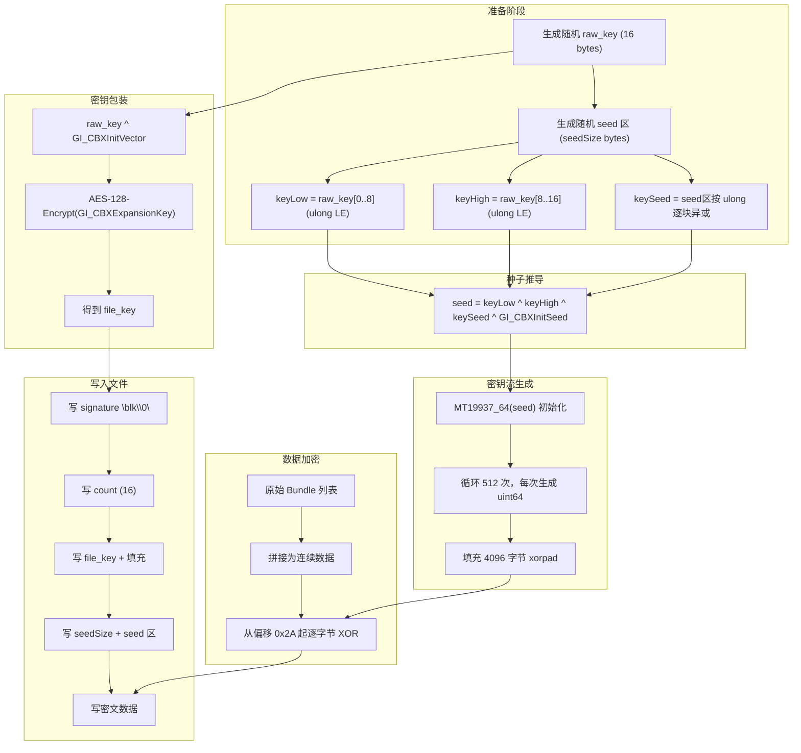
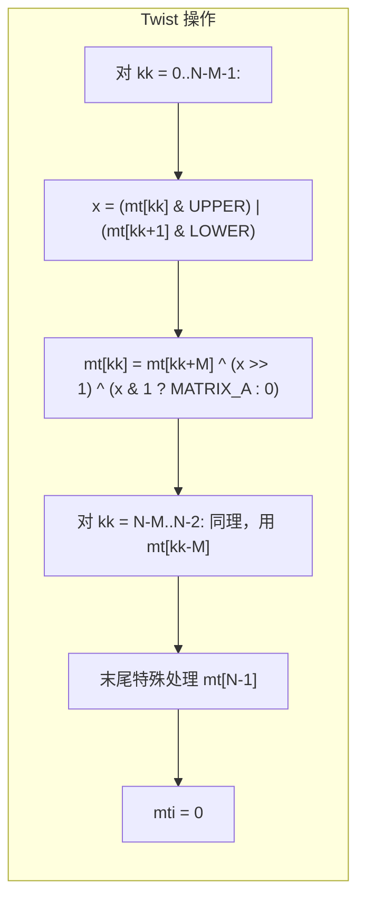
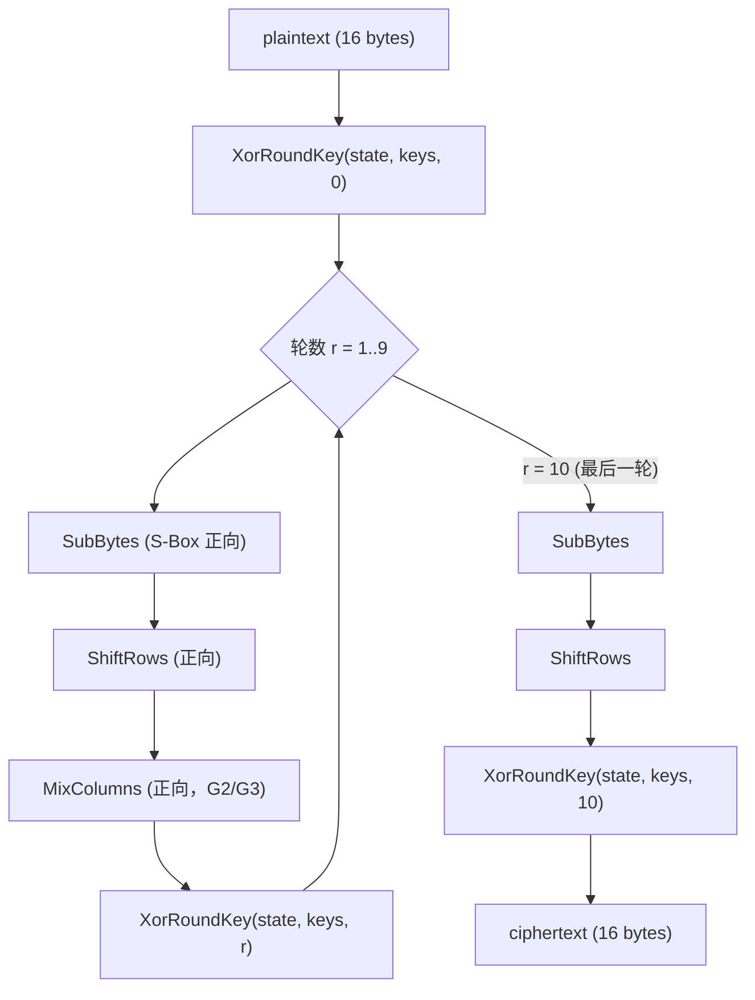
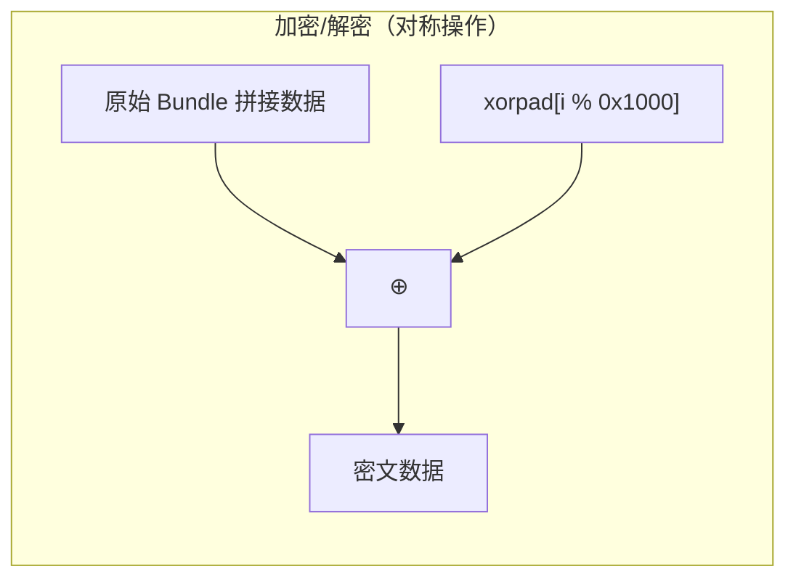
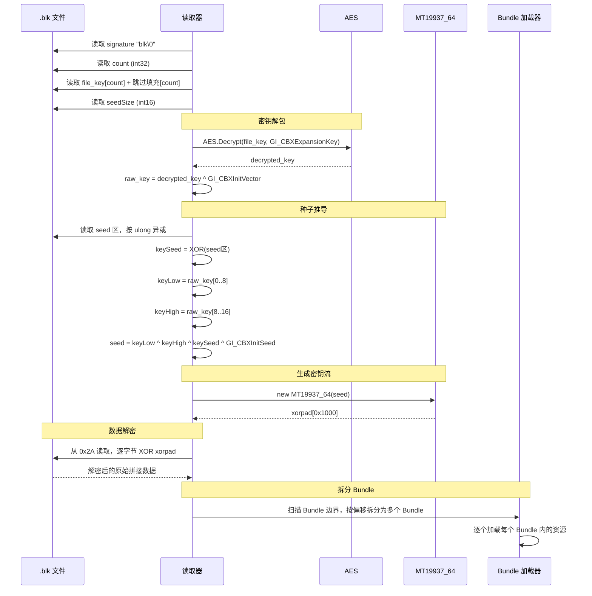
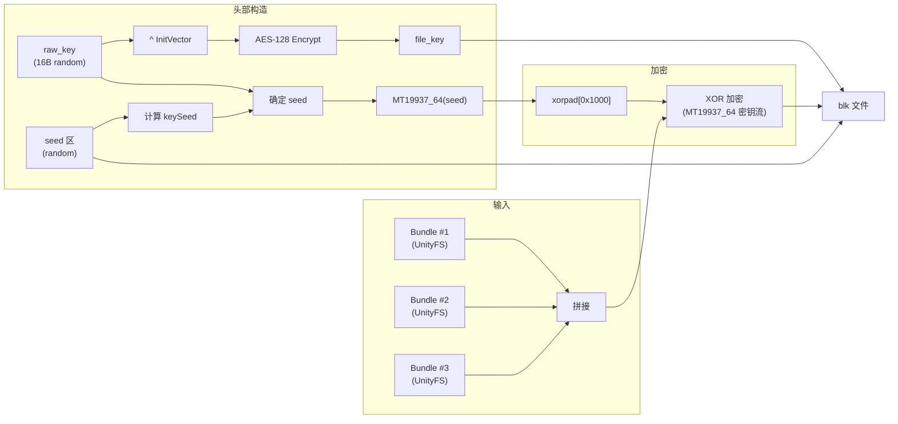
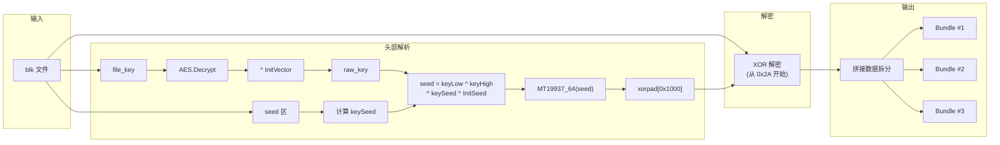
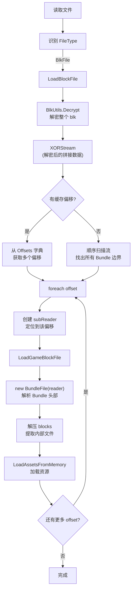
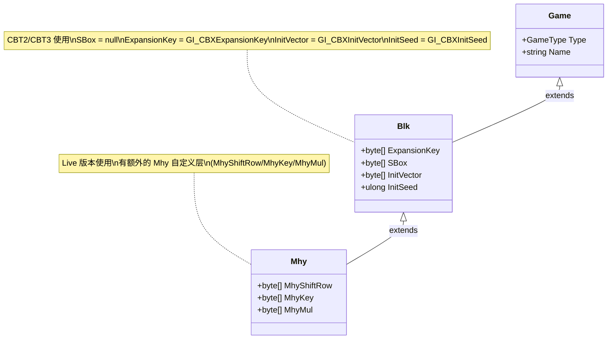
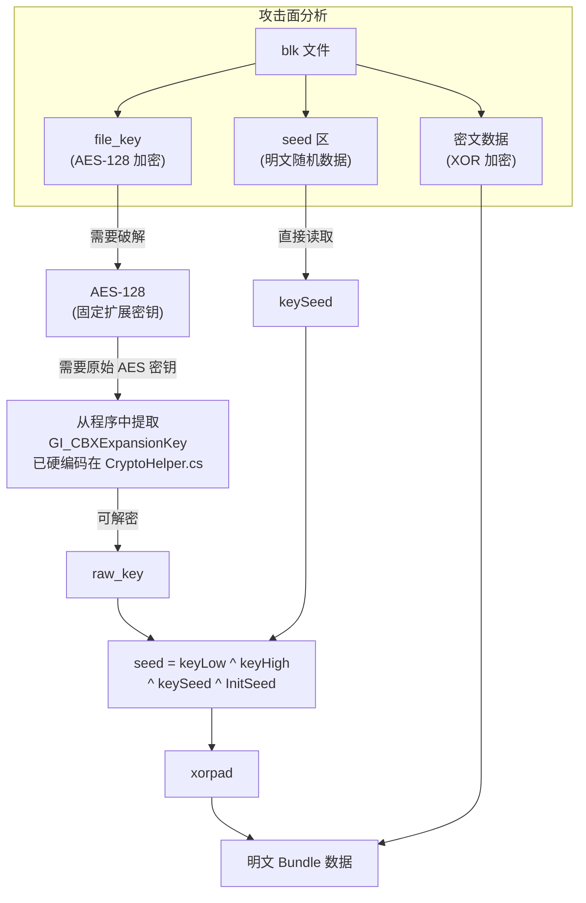

# blk 文件格式完整技术文档

> 基于 AnimeStudio 源码逆向分析，涵盖文件结构、加密算法、数据流全链路。
> 适用游戏：原神 CBT2 (`GI_CB2`) / CBT3 (`GI_CB3`)

---

## 1. 概述

`blk` 是米哈游《原神》CBT2/CBT3 时期使用的资源封包格式。它是一个**容器**，将多个 Unity Bundle 拼接后统一加密，打包为单个 `.blk` 文件。读取时先解密还原出拼接数据，再按偏移拆分为多个独立 Bundle 逐个加载。

**核心特性：**

| 特性 | 说明 |
|---|---|
| 容器关系 | 1 个 `.blk` 包含 N 个 Unity Bundle |
| 加密粒度 | 容器级别（整体加密，非逐 Bundle 加密） |
| 加密算法 | MT19937_64 生成 XOR 密钥流 |
| 密钥包装 | AES-128 加密 + IV 异或，写入文件头 |
| 数据偏移 | 固定 `0x2A` |
| 密钥流长度 | 4096 字节（循环使用） |

---

## 2. 文件结构

### 2.1 整体布局

```
偏移量                大小              内容
──────────────────────────────────────────────────────────────
0x00                  4 字节            Signature "blk\0"
0x04                  4 字节            count (int32 LE) — 密钥长度
0x08                  count 字节        file_key[count] — AES 加密后的密钥
0x08 + count          count 字节        填充（与 file_key 等长的零值）
0x08 + 2*count        2 字节            seedSize (int16 LE)
紧接其后              seedSize 字节     seed 区（原始随机数据）
0x2A (DataOffset)     剩余全部          密文数据区
```

### 2.2 结构图

```mermaid
block-beta
    columns 1
    block:header
        columns 14
        h1["sig\n\"blk\\0\""]:2
        h2["count\n(int32)"]:2
        h3["file_key\n(16 bytes)"]:4
        h4["padding\n(16 bytes)"]:4
        h5["seedSize\n(int16)"]:2
    end
    block:body
        columns 6
        b1["seed 区\n(seedSize bytes)"]:6
    end
    block:data
        columns 1
        d1["密文数据区（XOR 加密）\n从 0x2A 开始"]:1
    end
    block:decrypted
        columns 1
        d2["解密后 = 多个 Bundle 紧密拼接\nBundle #1 | Bundle #2 | Bundle #3 | ..."]:1
    end

    header --> body
    body --> data
    data --> decrypted
```

**blk 文件不存储 Bundle 的 offset 表。** 每个 Bundle 自身是自描述的 Unity 格式，其头部包含 `size` 字段，读完一个 Bundle 后流的位置自然指向下一个 Bundle 的起始处。

### 2.3 各字段说明

#### Signature（4 字节）
- 固定字符串 `"blk\0"`（`0x62 0x6C 0x6B 0x00`），用于识别文件类型。

#### count（4 字节，int32 LE）
- 密钥长度。CBT2/CBT3 中通常为 `16`（即 16 字节密钥 + 16 字节填充）。
- 实际参与后续种子推导的只有前 16 字节。

#### file_key（count 字节）
- 对原始随机密钥 `raw_key` 经 `IV 异或 → AES-128 加密` 后的结果。
- 读取时逆序解密：`AES.Decrypt → IV 异或` 还原出 `raw_key`。

#### 填充（count 字节）
- 与 `file_key` 等长的全零填充，读取时跳过，不参与任何运算。

#### seedSize（2 字节，int16 LE）
- seed 区的字节长度。CBT2/CBT3 中没有 SBox，上限为 `0x800`（2048 字节）。
- 实际值由打包时随机生成的 seed 区大小决定。

#### seed 区（seedSize 字节）
- 随机字节序列。读取时按 `ulong`（8 字节）逐块异或，得到 `keySeed`。

#### 密文数据区（从 0x2A 开始）

解密后得到连续的多个 Unity Bundle 的拼接数据。**blk 文件本身不存储任何 offset 表**，每个 Bundle 的边界由 Bundle 自身的 `size` 字段决定。

##### 多 Bundle 的拼接结构

```
解密后的数据区（从 0x2A 开始）:
┌──────────────────────────────────────────────────────────────┐
│ Bundle #1                          offset = 0x00000000      │
│ ┌──────────────────────────────────────────────────────────┐ │
│ │ Header: UnityFS\0 + version + size(=S1) + ...           │ │
│ │ BlocksInfo (compressed)                                  │ │
│ │ Data Blocks (compressed)                                 │ │
│ └──────────────────────────────────────────────────────────┘ │
│                          offset = S1                         │
│ Bundle #2                                                    │
│ ┌──────────────────────────────────────────────────────────┐ │
│ │ Header: UnityFS\0 + version + size(=S2) + ...           │ │
│ │ BlocksInfo (compressed)                                  │ │
│ │ Data Blocks (compressed)                                 │ │
│ └──────────────────────────────────────────────────────────┘ │
│                          offset = S1 + S2                    │
│ Bundle #3                                                    │
│ ┌──────────────────────────────────────────────────────────┐ │
│ │ ...                                                      │ │
│ └──────────────────────────────────────────────────────────┘ │
│                          ...                                 │
└──────────────────────────────────────────────────────────────┘
```

每个 Bundle 的 `size` 字段（UnityFS 头部中的 `int64`）记录了该 Bundle 的完整字节数。读取完 Bundle #1 后，流位置自然落在 Bundle #2 的起始处，以此类推，直到流耗尽。

##### offset 的来源（两种方式）

| 方式 | 来源 | 时机 |
|---|---|---|
| **CABMap 缓存** | 外部 `.bin` 文件，预先扫描所有 blk 的每个 Bundle 后记录 `{ blk路径 → [offset列表] }` | 构建时/首次扫描后 |
| **顺序扫描** | 运行时逐个读取 Bundle，读完一个后流位置自然前进到下一个 | 无缓存时 |

##### 顺序扫描的具体实现（`OffsetStream.GetOffsets`）

```csharp
// OffsetStream.cs
public IEnumerable<long> GetOffsets(string path)
{
    if (AssetsHelper.TryGet(path, out var offsets))
    {
        // 方式一：有 CABMap 缓存，直接用预存的偏移列表
        foreach (var offset in offsets)
        {
            Offset = offset;
            yield return offset;
        }
    }
    else
    {
        // 方式二：无缓存，顺序扫描
        while (Remaining > 0)
        {
            Offset = AbsolutePosition;       // 将 OffsetStream 的起点移到当前位置
            yield return AbsolutePosition;   // 返回当前偏移，作为 Bundle 的起始位置
            // 调用方 LoadGameBlockFile 会读取一个完整的 Bundle
            // BundleFile 构造时读取 size 字段，并按 size 消费完整个 Bundle
            // 读取完成后，BaseStream.Position 自然指向下一个 Bundle 的开头
            if (Offset == AbsolutePosition)  // 如果没读到任何数据（流耗尽/读取失败）
                break;
        }
    }
}
```

**关键机制**：每个 Unity Bundle 是自描述的——通过解析 Bundle 头部获取 `size`，然后按 `size` 消费数据。无需在 blk 文件中额外存储 offset 表。Bundle 之间紧密拼接，无填充、无分隔符。

---

## 3. 加密常量

所有常量定义在 `CryptoHelper.cs` 的 `#region CBX` 中。

### 3.1 AES-128 扩展密钥表

```csharp
// 0xB0 字节 = 11 轮 × 16 字节轮密钥
GI_CBXExpansionKey = {
    0x3C, 0x5E, 0xAD, 0x0F, 0xD5, 0x09, 0x27, 0x3F,
    0xB8, 0x70, 0x00, 0x9A, 0xCD, 0x30, 0x1B, 0xEB,
    // ... 共 176 字节
    0xBE, 0xAE, 0x3A, 0x31, 0x14
}
```

这是由原始 AES-128 密钥通过密钥扩展算法预计算的 11 轮轮密钥表。AES-128 共 10 轮加密，每轮需要 16 字节轮密钥，加上初始轮共 11 轮。

### 3.2 初始化向量

```csharp
GI_CBXInitVector = {
    0xA2, 0x25, 0x25, 0x99, 0xB7, 0x62, 0xF4, 0x39,
    0x28, 0xE1, 0xB7, 0x73, 0x91, 0x05, 0x25, 0x87
}
```

16 字节 IV，用于与 `raw_key` 进行异或操作，增加 `file_key` 的分析难度。

### 3.3 固定种子常量

```csharp
GI_CBXInitSeed = 0xCEAC3B5A867837AC  // ulong
```

参与 MT19937_64 种子推导的固定常量，每款游戏不同。

### 3.4 其他常量

```csharp
DataOffset    = 0x2A        // 数据区起始偏移
KeySize       = 0x1000      // XOR 密钥流长度（4096 字节）
SeedBlockSize = 0x800       // 无 SBox 时 seed 区上限
```

---

## 4. 加密算法详解

### 4.1 加密流程总览



### 4.2 MT19937_64 伪随机数生成器

#### 算法参数

```csharp
const ulong N         = 312;      // 状态数组大小
const ulong M         = 156;      // 中间偏移
const ulong MATRIX_A  = 0xB5026F5AA96619E9;  // 矩阵 A 系数
const ulong UPPER_MASK = 0xFFFFFFFF80000000;  // 高 33 位掩码
const ulong LOWER_MASK = 0x7FFFFFFF;          // 低 31 位掩码
```

#### 初始化

```csharp
void Init(ulong seed)
{
    mt[0] = seed;
    for (mti = 1; mti < N; mti++)
    {
        mt[mti] = 6364136223846793005 * (mt[mti-1] ^ (mt[mti-1] >> 62)) + mti;
    }
    mti = N;  // 标记需要 twist
}
```

#### Twist 变换

当 `mti >= N` 时触发，更新整个状态数组：



#### Tempering 变换

每次输出时对状态值 `x` 进行熟化：

```csharp
x ^= (x >> 29) & 0x5555555555555555;   // 右移 29 位，掩码取半字节
x ^= (x << 17) & 0x71D67FFFEDA60000;   // 左移 17 位
x ^= (x << 37) & 0xFFF7EEE000000000;   // 左移 37 位
x ^= (x >> 43);                         // 右移 43 位
return x;
```

#### 密钥流生成

```csharp
var mt64 = new MT19937_64(seed);
var xorpad = new byte[0x1000];  // 4096 字节
for (int i = 0; i < 0x1000; i += 8)
{
    WriteUInt64LE(xorpad[i..i+8], mt64.Int64());
}
```

共生成 `0x1000 / 8 = 512` 个 `uint64` 值，填充为 4096 字节密钥流。

### 4.3 AES-128 加密

> 注意：代码中只实现了 `AES.Decrypt`（解密），加密需要自行实现其逆过程。

#### 加密流程（AES-128 标准 10 轮）



#### 与解密的关键差异

| 操作 | 解密（代码中 `AES.Decrypt`） | 加密（需自行实现） |
|---|---|---|
| SubBytes | `LookupSBoxInv`（逆 S-Box） | 标准 AES S-Box |
| ShiftRows | `ShiftRowsTableInv` | `ShiftRowsTableInv` 的逆 |
| MixColumns | `LookupG9/G11/G13/G14`（逆 MixCol） | G2/G3 乘法表（正向 MixCol） |
| 轮密钥顺序 | 0 → 1 → ... → 10（不变） | 0 → 1 → ... → 10（不变） |

### 4.4 XOR 数据加密



```csharp
// XORStream.Read 核心逻辑
public override int Read(byte[] buffer, int offset, int count)
{
    var pos = Index;  // 当前位置相对于 0x2A 的偏移
    base.Read(buffer, offset, count);
    for (int i = offset; i < count; i++)
    {
        buffer[i] ^= _xorpad[pos++ % _xorpad.Length];  // 循环使用 4096 字节
    }
}
```

XOR 操作是对称的，加密和解密使用完全相同的逻辑。

---

## 5. 解密流程



### 5.1 解密代码（`BlkUtils.Decrypt`）

```csharp
public static XORStream Decrypt(FileReader reader, Blk blk)
{
    // 1. 读 header
    var signature = reader.ReadStringToNull();  // "blk"
    var count = reader.ReadInt32();             // 密钥长度
    var key = reader.ReadBytes(count);          // file_key
    reader.Position += count;                   // 跳过填充
    var seedSize = Math.Min(reader.ReadInt16(),
        blk.SBox.IsNullOrEmpty() ? SeedBlockSize : SeedBlockSize * 2);

    // 2. SBox 处理（CBT2/CBT3 无此步骤，SBox 为 null）
    if (!blk.SBox.IsNullOrEmpty() && blk.Type.IsGI())
    {
        for (int i = 0; i < 0x10; i++)
            key[i] = blk.SBox[(i % 4 * 0x100) | key[i]];
    }

    // 3. AES 解密
    AES.Decrypt(key, blk.ExpansionKey);

    // 4. IV 异或
    for (int i = 0; i < 0x10; i++)
        key[i] ^= blk.InitVector[i];

    // 5. 计算 keySeed
    ulong keySeed = ulong.MaxValue;
    for (int i = 0; i < seedSize; i += 8)
        keySeed ^= reader.ReadUInt64();

    // 6. 推导 MT 种子
    var keyLow  = ReadUInt64LE(key[0..8]);
    var keyHigh = ReadUInt64LE(key[8..16]);
    var seed = keyLow ^ keyHigh ^ keySeed ^ blk.InitSeed;

    // 7. 生成密钥流
    var mt64 = new MT19937_64(seed);
    var xorpad = new byte[KeySize];  // 0x1000
    for (int i = 0; i < KeySize; i += 8)
        WriteUInt64LE(xorpad[i..i+8], mt64.Int64());

    // 8. 返回 XORStream
    return new XORStream(reader.BaseStream, DataOffset, xorpad);
}
```

---

## 6. 完整数据流

### 6.1 加密方向（打包）



### 6.2 解密方向（读取）



### 6.3 文件类型识别与分发



---

## 7. 类型体系



### 7.1 不同游戏类型的 Blk 实例

| 游戏版本 | GameType | 类 | 密钥差异 |
|---|---|---|---|
| 原神 CBT2 | `GI_CB2` | `Blk` | `GI_CBXExpansionKey` + `GI_CBXInitVector` + `GI_CBXInitSeed` |
| 原神 CBT3 | `GI_CB3` | `Blk` | 同上 |
| 原神 CBT3 Pre | `GI_CB3Pre` | `Mhy` | 另有 `GI_CBXMhyShiftRow/Key/Mul` + `GI_CBXSBox` |
| 原神 Live | `GI` | `Mhy` | `GIMhyShiftRow/Key/Mul` + `GIExpansionKey` + `GISBox` |

---

## 8. 安全性分析



**总结：** 加密方案的安全性完全依赖于 AES-128 扩展密钥的保密性。由于 `GI_CBXExpansionKey` 已硬编码在程序中，攻击者可以：

1. 从 `file_key` 解密出 `raw_key`
2. 从 `seed 区` 直接计算 `keySeed`
3. 推导出 `seed`，生成 `xorpad`
4. 解密所有数据

这是一层**混淆性保护**而非真正的密码学安全，主要目的是阻止直接读取，而非抵抗有针对性的逆向分析。

---

## 9. 与 Mhy 格式的对比

| 特性 | Blk（CBT2/CBT3） | Mhy（Live 版本） |
|---|---|---|
| 类继承 | `Blk : Game` | `Mhy : Blk` |
| SBox | 无（null） | 有（GISBox / GI_CBXSBox） |
| 额外层 | 无 | MhyShiftRow + MhyKey + MhyMul 自定义变换 |
| seedSize 上限 | 0x800 | 0x1000（有 SBox 时翻倍） |
| 密钥流长度 | 0x1000 | 0x1000（相同） |
| 数据偏移 | 0x2A | 0x2A（相同） |

---

## 10. 附录：种子初始化注意点

`MT19937_64` 的构造函数中存在一个容易忽略的细节：

```csharp
public MT19937_64(ulong seed)
{
    Init(seed);  // 初始化后 mti = N
}

public ulong Int64()
{
    if (mti >= N)
    {
        if (mti == N + 1)
        {
            Init(5489UL);  // 首次调用时先用默认种子初始化
        }
        // 然后执行 twist...
    }
    // ...
}
```

第一次调用 `Int64()` 时，`mti == N + 1`（由构造函数设置 `mti = N`，未在此处递增），会先用默认种子 `5489` 执行 `Init` + twist，再回到用户指定的 `seed` 重新 `Init`。这是标准 MT19937 实现的行为，打包时需确保实现一致的初始化逻辑。