# Unity 运行时加载 blk 的工作机制推测

> 基于 AnimeStudio 源码逆向分析，结合 Unity AssetBundle 加载原理，推测原神 CBT2/CBT3 运行时如何发现、定位、加载 blk 中的资源。

---

## 1. 整体架构

blk 是米哈游在原神 CBT2/CBT3 时期使用的资源容器格式。它不是简单的"文件→Bundle"映射，而是一套**内容寻址的分层索引系统**。

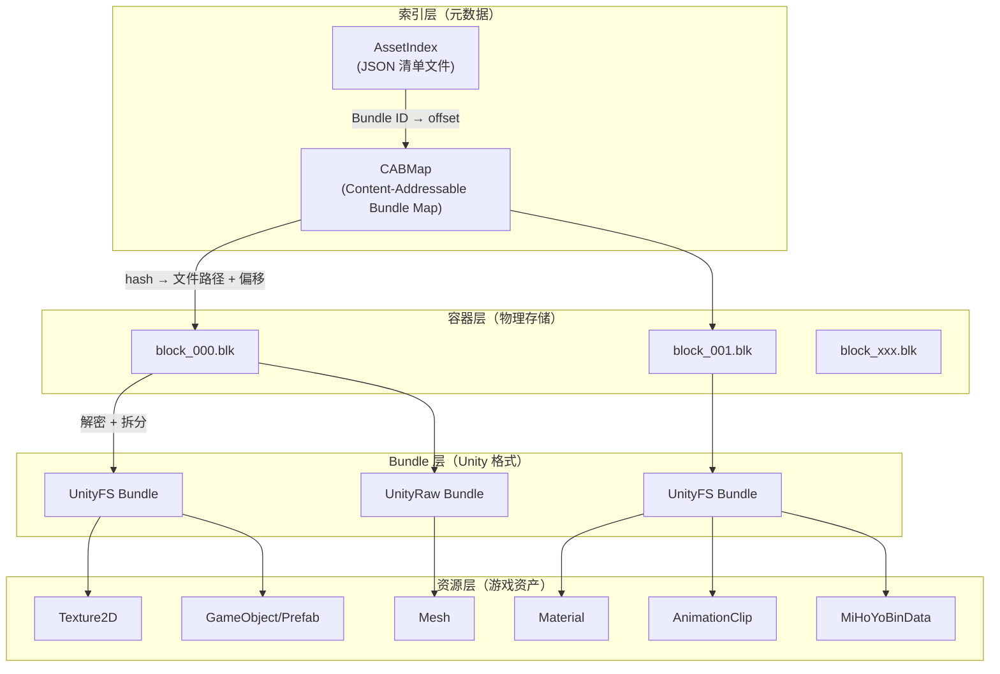

---

## 2. 索引系统

### 2.1 AssetIndex（资源索引）

`AssetIndex` 是一个 JSON 文件，记录了游戏中所有资源的元数据。其结构如下：

```csharp
record AssetIndex {
    Dictionary<string, string> Types;           // 类型名 → 程序集名映射
    Dictionary<int, List<SubAssetInfo>> SubAssets;  // 资产ID → 子资产列表
    Dictionary<int, List<int>> Dependencies;    // 资产ID → 依赖资产ID列表
    List<uint> PreloadBlocks;                   // 预加载的 block 列表
    List<uint> PreloadShaderBlocks;             // 预加载的 shader block 列表
    Dictionary<int, BlockInfo> Assets;          // 资产ID → 所在 block 信息
    List<uint> SortList;                        // 排序列表
}
```

**关键结构 `BlockInfo`**：每个资产记录它所属的 Bundle 编号和在该 Bundle 内的偏移。

```csharp
record BlockInfo {
    byte Language;    // 语言版本
    uint Id;          // Bundle 编号（对应 CABMap 中的 block hash）
    uint Offset;      // 资产在 Bundle 内的偏移
}
```

### 2.2 CABMap（内容寻址 Bundle 映射）

CABMap 是一个二进制文件（`.bin`），通过 `BuildCABMap` 扫描所有 `.blk` 文件生成。它建立了**内容哈希 → 文件路径 + 偏移**的映射：

```csharp
// CABMap 结构
Dictionary<string, Entry> CABMap;

record Entry {
    string Path;              // blk 文件相对于 BaseFolder 的路径
    long Offset;              // Bundle 在该 blk 文件中的偏移
    List<string> Dependencies; // 该 Bundle 依赖的其他 Bundle 的哈希
}
```

**CABMap 的构建过程**：
1. 遍历所有 `.blk` 文件
2. 对每个 blk 解密，拆分为多个 Bundle
3. 对每个 Bundle，解析其内部的 `AssetBundle` 对象
4. 提取内容哈希（`fileName`）和依赖关系
5. 记录哈希对应的文件路径和偏移

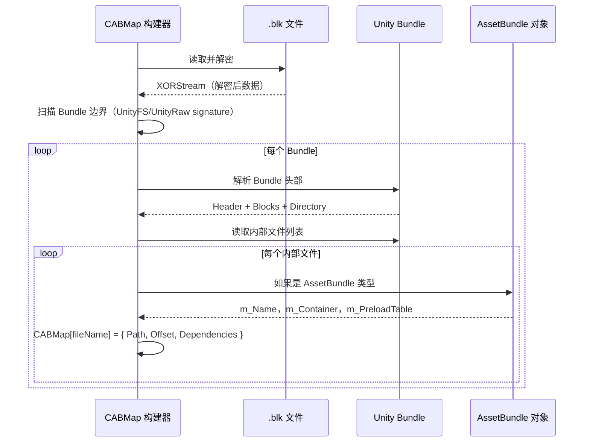

### 2.3 运行时索引查找流程

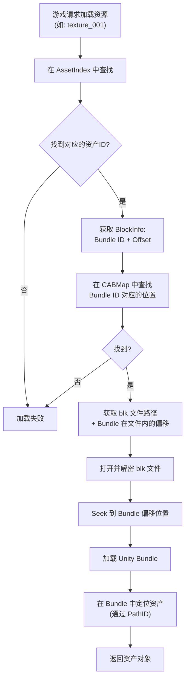

---

## 3. 运行时加载流程

### 3.1 启动阶段

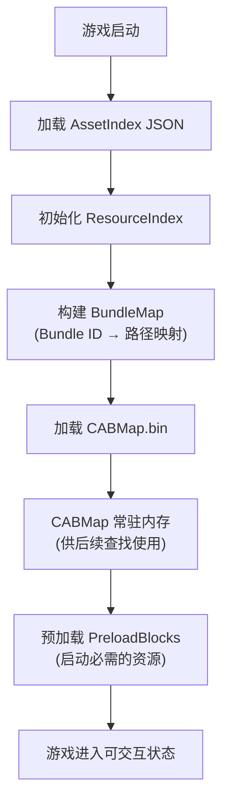

### 3.2 单个资源加载流程

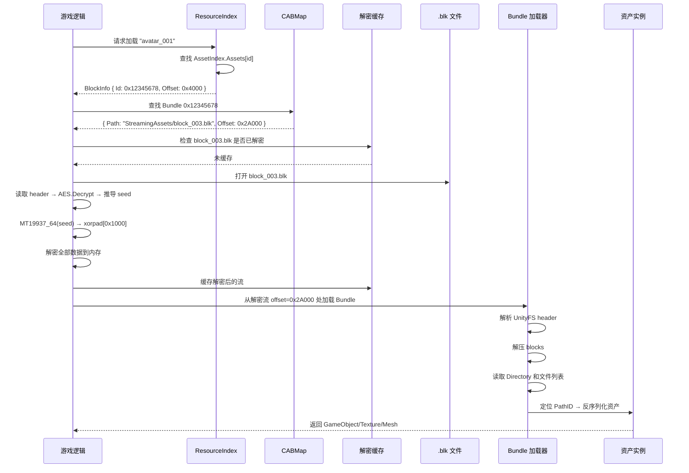

### 3.3 解密缓存策略

由于一个 blk 包含多个 Bundle，最合理的策略是：

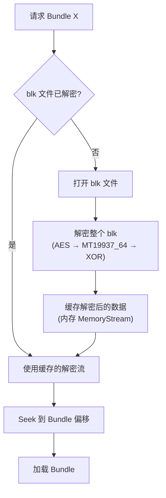

**关键点**：只需解密一次，后续对同一 blk 文件的访问直接复用解密后的数据。解密后的数据可保留在内存中，或使用 `MemoryMappedFile` 映射到磁盘临时文件。

### 3.4 依赖解析

当一个 Bundle 被加载时，它可能依赖其他 Bundle：

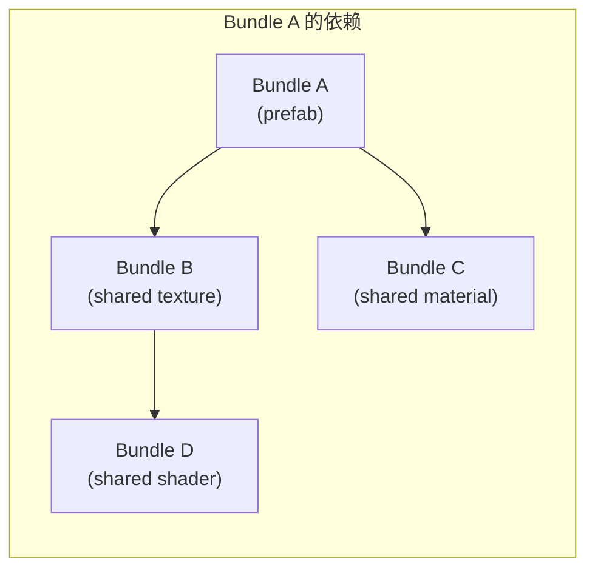

依赖解析通过 CABMap 中的 `Dependencies` 字段实现：

```csharp
// CABMap entry for Bundle A
Entry {
    Path = "StreamingAssets/block_003.blk",
    Offset = 0x2A000,
    Dependencies = ["hash_of_Bundle_B", "hash_of_Bundle_C"]
}
```

依赖的 Bundle 可能在同一 blk 或不同 blk 中，CABMap 通过哈希查找统一处理。

---

## 4. 资源类型体系

### 4.1 AssetBundle 容器

`AssetBundle` 是 Unity 的容器类型，存储了路径到资产的映射：

```csharp
class AssetBundle {
    List<PPtr<Object>> m_PreloadTable;         // 预加载资产指针表
    List<KeyValuePair<string, AssetInfo>> m_Container;  // 路径 → 资产信息
}

class AssetInfo {
    int preloadIndex;      // 在 PreloadTable 中的起始索引
    int preloadSize;       // 连续的资产数量
    PPtr<Object> asset;    // 主资产指针
}
```

**加载时**：遍历 `m_Container`，根据 `preloadIndex` 和 `preloadSize` 从 `m_PreloadTable` 中取出对应的资产指针，建立路径到资产的映射。

### 4.2 资源类型枚举

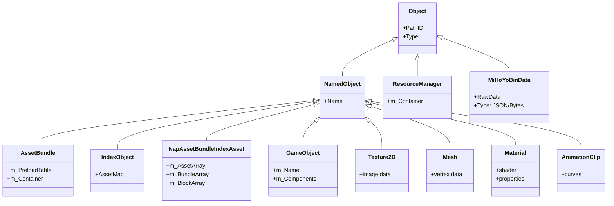

### 4.3 MiHoYoBinData（米哈游自定义数据）

米哈游在 Unity 中扩展了自定义资产类型 `MiHoYoBinData`，用于存储游戏配置数据：

```csharp
class MiHoYoBinData {
    byte[] RawData;    // 二进制数据
    // 运行时可能附加 XOR 解密
    // 内容可能是 JSON 或二进制
}
```

这些数据通常通过 `IndexObject` 进行索引：

```csharp
class IndexObject {
    List<KeyValuePair<string, Index>> AssetMap;
    // Key: 资源名称（如 "Config/Avatar/10000001"）
    // Value: Index { PPtr<Object>, Size }
}
```

---

## 5. 完整运行时数据流

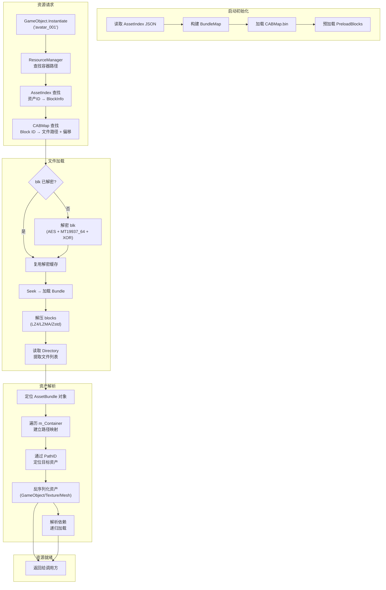

---

## 6. 关键推测

### 6.1 为什么用 blk 容器格式

| 问题 | 推测 |
|---|---|
| 为什么多个 Bundle 打成一个 blk？ | 减少文件数量，降低文件系统开销。移动端尤其重要，减少 inode 使用和文件打开次数。 |
| 为什么只对 CBT 使用？ | Live 版本改用 `Mhy` 格式（额外的 `MhyShiftRow/Key/Mul` 层），安全性更高。blk 可能是早期方案。 |
| 为什么用 XOR 而不用 AES 全加密？ | 性能考虑。XOR 流解密极快，MT19937_64 生成密钥流只需要整数运算。对移动端 CPU 友好。 |
| 为什么 AES 只加密 key？ | 密钥材料（16 字节）用 AES 保护，数据体用 XOR。平衡了安全性和性能。 |

### 6.2 文件组织推测

基于 CBT 构建的常见模式，文件结构如下：

```
StreamingAssets/
├── AssetIndex.json          # 资源索引清单
├── block_000.blk            # 核心资源（启动必需）
├── block_001.blk            # 角色资源
├── block_002.blk            # 场景资源
├── block_003.blk            # UI 资源
├── ...
└── block_xxx.blk            # 其他资源
```

每个 blk 文件按功能或场景分组，配合 AssetIndex 中 `PreloadBlocks` 列表实现按需加载。

### 6.3 内存管理策略

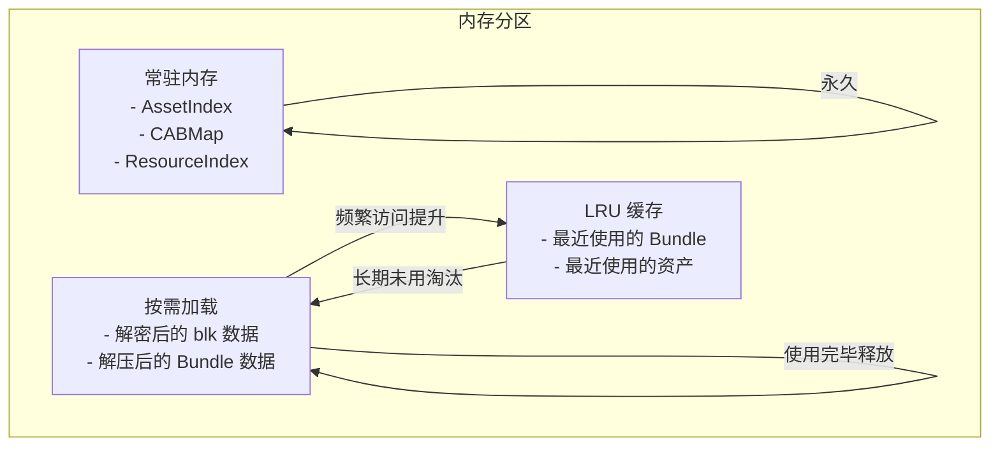

### 6.4 与 Live 版本（Mhy 格式）的演进

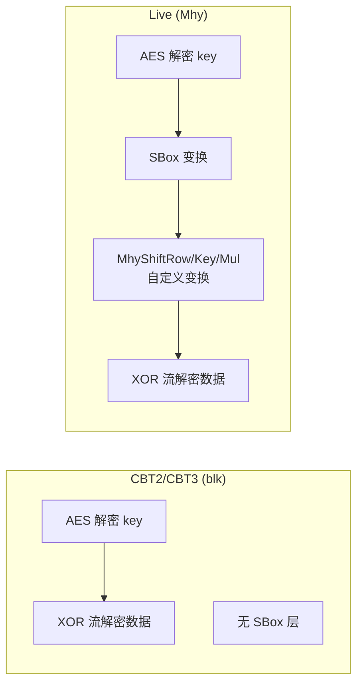

Live 版本在 AES 解密和 XOR 解密之间增加了多层自定义变换，安全性显著提升，但核心思路（MT19937_64 + XOR 流）保持不变。

---

## 7. 总结

blk 的运行时加载体系可以概括为：

1. **索引层**：`AssetIndex`（JSON）提供资源 ID 到 Bundle ID 的映射，`CABMap`（二进制）提供 Bundle ID 到文件路径 + 偏移的映射
2. **容器层**：`.blk` 文件 = 多个 Unity Bundle 的拼接 + 整体 XOR 加密
3. **解密层**：AES-128 解密密钥材料 → MT19937_64 生成 XOR 密钥流 → 解密整个容器
4. **Bundle 层**：标准 Unity Bundle 格式（UnityFS/UnityRaw），支持 LZ4/LZMA/Zstd 压缩
5. **资源层**：标准 Unity 资产（GameObject、Texture、Mesh 等）+ 米哈游自定义类型（MiHoYoBinData、IndexObject 等）
6. **缓存策略**：解密结果缓存复用，避免重复解密同一 blk