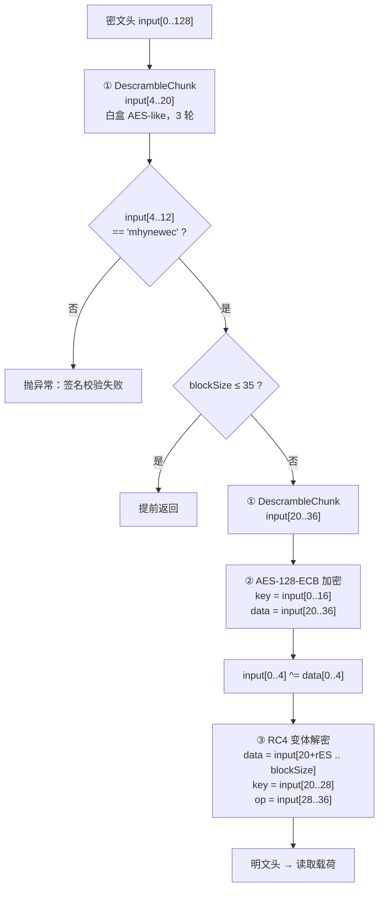
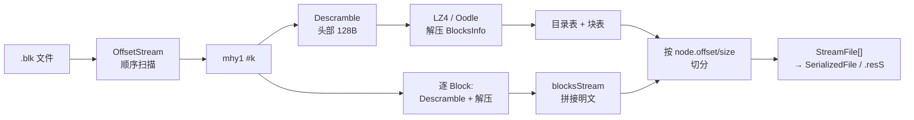

# mhy1 文件格式完整技术文档

> 基于 AnimeStudio 源码（`AnimeStudio/MhyFile.cs`、`Crypto/CryptoHelper.cs`、`EndianBinaryReader.cs`）反推，
> 涵盖容器结构、字段编码混淆、三层加密算法全链路。
> 适用游戏：《绝区零》正式版（`GameType.ZZZ`）。CBT2（`ZZZ_CB2`）使用同一加密算法但 `mhy0` 签名。

---

## 1. 概述

`mhy1` 是米哈游《绝区零》使用的 AssetBundle 封装格式，是 `mhy0`（原神 Live）的**第二代**。
它在结构上是 Unity `UnityFS` 的**私有替代品**：保留了 UnityFS 的"块（Block）+ 目录（Node）"二级模型，
但把所有元数据字段做了字节置换混淆，并对头部施加三层加密。

**核心特性：**

| 特性 | 说明 |
|---|---|
| 容器关系 | 1 个 `.blk` = N 个 `mhy1` **明文顺序拼接**（无外层加密） |
| 加密粒度 | 每个 mhy1 内部：BlocksInfo 头 + 每个数据块头，**各自独立**加密 |
| 加密范围 | 只加密每段的**前 128 字节**，其余为明文压缩流 |
| 第一层 | 白盒 AES-like 变换（ShiftRow + GF(2⁸) 乘法 + 4×256 S 盒 + 轮密钥） |
| 第二层 | AES-128-ECB（用作密钥派生函数，非机密性保护） |
| 第三层 | RC4 变体（固定初始 S 盒 + XOR/ADD/SUB 三态输出） |
| 密钥来源 | **全部自文件内派生**，外部秘密只有 5 张常量表 |
| 内嵌魔数 | 解密后头部含 ASCII `mhynewec`，校验字段恒为 `D9DADADA` |
| 压缩 | LZ4HC 或 Oodle Kraken（ZZZ 2.0 起，靠首字节 `0x8C` 嗅探） |
| 验证状态 | ✅ 已在真实文件上端到端验证（2612 子文件 / 0 失败，见 §13） |

**与 blk 格式的根本区别**（对比 [`blk-file-format.md`](blk-file-format.md)）：
原神 CBT 的 `.blk` 是**容器级整体加密**（MT19937_64 密钥流 XOR），内部是标准 UnityFS；
而 ZZZ 的 `.blk` 是**明文容器**，加密下沉到了每个 mhy1 内部。因此 `GameManager` 为 ZZZ 传入的
`expansionKey` / `initVector` / `initSeed` 全为 `null` / `0`——blk 层的密钥体系在 ZZZ 完全未启用。

---

## 2. 文件结构

### 2.1 容器层：.blk = N × mhy1

ZZZ 的 `.blk` 没有任何容器头，就是多个 mhy1 首尾相接：

```
┌──────────────┬────────┬──────────────┬────────┬──────────────┐
│  mhy1 #0     │ \0 填充 │  mhy1 #1     │ \0 填充 │  mhy1 #2 ... │
└──────────────┴────────┴──────────────┴────────┴──────────────┘
```

`FileReader.ParseFile` 把 ZZZ 的 `MhyFile` 强制改判为 `BlockFile`：

```csharp
// FileReader.cs
if (reader.FileType == FileType.MhyFile && (game.Type.IsZZZCB2() || game.Type.IsZZZ()))
    reader.FileType = FileType.BlockFile;
```

随后 `OffsetStream.GetOffsets` 顺序推进扫描：每次 yield 当前绝对位置，
`MhyFile` 构造函数读完一个子文件后流位置自然前进到下一个，直到位置不再变化为止。
子文件的定位靠两个机制：

1. **自描述长度**：`TotalSize = 8 + compressedBlocksInfoSize + Σ block.compressedSize`
2. **填充跳过**：构造函数末尾 `while (reader.PeekChar() == '\0') reader.Position++;`

若存在预建索引（`AssetsHelper.TryGet`），则直接使用缓存的偏移表，跳过顺序扫描。

### 2.2 mhy1 单文件布局

```
偏移量                    大小                内容
────────────────────────────────────────────────────────────────────────
0x00                      4 字节              Signature "mhy1"
0x04                      4 字节              compressedBlocksInfoSize (uint32 LE)
0x08                      N 字节              BlocksInfo 区（N = 上述字段，前 128B 加密）
0x08 + N                  C₀ 字节             Block #0（前 128B 加密）
0x08 + N + C₀             C₁ 字节             Block #1
...                       ...                 ...
0x08 + N + ΣCᵢ            —                   文件结束，后跟 \0 填充
```

> 注意 `signature` 用 `ReadStringToNull(4)` 读取，`compressedBlocksInfoSize` 之后**没有**
> Unity 常见的 `unityVersion` / `unityRevision` 字符串——它们是 AnimeStudio 伪造的常量
> （`5.x.x` / `2017.4.30f1`），仅为下游 `SerializedFile` 解析器兼容而填充。

### 2.3 结构图

```mermaid
block-beta
    columns 1
    block:hdr
        columns 8
        s1["sig\n\"mhy1\""]:2
        s2["cbiSize\n(uint32)"]:2
        s3["BlocksInfo 区\n(cbiSize 字节)"]:4
    end
    block:bi
        columns 8
        b1["加密头\n0..128"]:3
        b2["压缩流（明文）\n128..cbiSize"]:5
    end
    block:blocks
        columns 6
        c1["Block#0\n加密头+压缩流"]:2
        c2["Block#1"]:2
        c3["Block#N"]:2
    end
    hdr --> bi
    bi --> blocks
```

---

## 3. 加密头布局（关键）

BlocksInfo 区和每个 Block 都以一个**加密头**开始，二者结构相同但参数不同。
`Descramble(input, blockSize, entrySize)` 的两组调用参数：

| 段类型 | 调用 | blockSize | entrySize | roundedEntrySize | 载荷起点 offset |
|---|---|---|---|---|---|
| BlocksInfo | `DescrambleHeader2` | `min(len, 128)` | 28 | 32 | **48** |
| Block | `DescrambleEntry2` | `min(len, 128)` | 8 | 16 | **28** |

其中 `roundedEntrySize = (entrySize + 0xF) / 0x10 * 0x10`（向上对齐到 16），
RC4 加密区起点 = `20 + roundedEntrySize`，载荷起点 = `20 + entrySize`。

### 3.1 BlocksInfo 加密头（entrySize = 28）

```
区间          大小    处理方式                    内容
──────────────────────────────────────────────────────────────────────
[0x00, 0x04)  4B      最后 XOR data[0..4]         校验字段
[0x04, 0x14)  16B     DescrambleChunk #1          解出 "mhynewec" + 8B
[0x14, 0x24)  16B     DescrambleChunk #2 → AES    RC4 key(8B) + operation(8B)
[0x24, 0x30)  12B     ★ 不做任何处理               保留/填充
[0x30, 0x34)  4B      ★ 不做任何处理               载荷首 4 字节（明文）
[0x34, 0x80)  76B     RC4 变体解密                 载荷
[0x80, N)     —       明文                        压缩流剩余部分
```

★ 标记的 `[0x24, 0x34)` 共 16 字节完全未被任何变换触及——这是 `entrySize`(28) 与
`roundedEntrySize`(32) 不相等造成的"缝隙"，是格式的真实特征而非实现疏漏。

**载荷（从 0x30 起）的结构：**

```
[0x30, 0x37)  7B   ReadMhyUInt → uncompressedBlocksInfoSize
[0x37, N)     —    压缩数据（LZ4HC 或 Oodle）
```

压缩流首字节位于文件绝对偏移 `0x08 + 0x37 = 0x3F`，`isOodle` 就是嗅探这一字节：

```csharp
isOodle = compressedBlocksInfo[0] == 0x8C;   // Oodle Kraken 首字节
```

> 源码注释指出：ZZZ 2.0 起改用 Oodle，但 `flags` 仍标为 LZ4——所以只能靠字节嗅探。

### 3.2 Block 加密头（entrySize = 8）

```
区间          大小    处理方式                    内容
──────────────────────────────────────────────────────────────────────
[0x00, 0x04)  4B      最后 XOR data[0..4]         校验字段
[0x04, 0x14)  16B     DescrambleChunk #1          解出 "mhynewec" + 8B
[0x14, 0x1C)  8B      DescrambleChunk #2 → AES    RC4 key
[0x1C, 0x24)  8B      DescrambleChunk #2 → AES    operation ★同时是载荷首 8 字节
[0x24, 0x80)  92B     RC4 变体解密                 载荷
[0x80, C)     —       明文                        压缩流剩余部分
```

★ **这是格式中最精巧的一处设计**：Block 的载荷起点是 0x1C，而 `[0x1C, 0x24)` 正是
AES 输出的后 8 字节（RC4 的 `operation` 选择器）。也就是说，压缩数据的前 8 字节
**既是数据本身，又充当 RC4 的操作模式选择器**——打包时把这 8 字节经 AES 逆变换藏进头部，
解包时还原出来后一物两用。BlocksInfo 头没有这个复用（缝隙为明文），二者布局并不对称。

### 3.3 小块早退

```csharp
if (blockSize <= 35) return;
```

当段长 ≤ 35 字节时，只执行 Chunk #1 解扰与签名校验，**不做** AES、RC4 和首 4 字节 XOR。
`ReadBlocks` 另有下限保护 `compressedSize < 0x10 → throw`。

> **实现边界**：段长落在 `[16, 20)` 时，`input.Slice(4, 16)` 会越界抛异常——
> 下限校验（0x10）与 Chunk #1 的实际需求（0x14）不匹配。实践中不会出现这么小的块。

---

## 4. BlocksInfo 明文结构

解密 + 解压后得到 BlocksInfo 明文，布局如下（**目录在前、块表在后**，与标准 UnityFS 相反）：

```
字段                    编码            大小        说明
──────────────────────────────────────────────────────────────────
nodesCount              ReadMhyInt      6 B         目录项数量
├─ Node[0].path         ReadMhyString   261 B       固定长度字段，\0 结尾
├─ Node[0].isSerialized ReadBoolean     1 B         true → flags = 4
├─ Node[0].offset       ReadMhyInt      6 B         在解压后 blocksStream 中的偏移
├─ Node[0].size         ReadMhyUInt     7 B         节点大小
├─ Node[1] ...                          275 B       每项固定 275 字节
blocksCount             ReadMhyInt      6 B         数据块数量
├─ Block[0].compressed  ReadMhyInt      6 B         压缩后大小（含 128B 加密头）
├─ Block[0].uncompressed ReadMhyUInt    7 B         解压后大小
├─ Block[1] ...                         13 B        每项固定 13 字节
```

**总长公式**：`6 + 275·nodesCount + 6 + 13·blocksCount`

`isSerialized` 为 true 时 `flags = 4`（`kArchiveNodeFlagsSerializedFile`），
标识该节点是 SerializedFile 而非资源流（`.resS` / `.resource`）。

---

## 5. 整数与字符串编码混淆

mhy1 不用标准整数编码，所有元数据整数都是**固定长度的字节置换 + 垃圾字节填充**。
这不是变长编码（如 LEB128），长度是固定的。

### 5.1 ReadMhyInt（6 字节 → int32）

```csharp
var buffer = ReadBytes(6);
return buffer[2] | (buffer[4] << 8) | (buffer[0] << 0x10) | (buffer[5] << 0x18);
```

| 结果字节 | 来源下标 |
|---|---|
| bits 0–7   | `buffer[2]` |
| bits 8–15  | `buffer[4]` |
| bits 16–23 | `buffer[0]` |
| bits 24–31 | `buffer[5]` |

**垃圾字节**：`buffer[1]`、`buffer[3]`（2 字节随机填充）

### 5.2 ReadMhyUInt（7 字节 → uint32）

```csharp
var buffer = ReadBytes(7);
return (uint)(buffer[1] | (buffer[6] << 8) | (buffer[3] << 0x10) | (buffer[2] << 0x18));
```

| 结果字节 | 来源下标 |
|---|---|
| bits 0–7   | `buffer[1]` |
| bits 8–15  | `buffer[6]` |
| bits 16–23 | `buffer[3]` |
| bits 24–31 | `buffer[2]` |

**垃圾字节**：`buffer[0]`、`buffer[4]`、`buffer[5]`（3 字节随机填充）

> 两种编码的置换模式**互不相同**，且 `int` 与 `uint` 分别使用——
> 这不是类型语义差异，纯粹是让两种字段的字节布局看起来不一样。

### 5.3 ReadMhyString（261 字节定长）

```csharp
var pos = BaseStream.Position;
var str = ReadStringToNull();
BaseStream.Position += 0x105 - (BaseStream.Position - pos);
```

字段固定 `0x105 = 261` 字节，读到第一个 `\0` 为止，剩余空间跳过（内容不确定，可能是残留数据）。

---

## 6. 加密算法详解

### 6.1 三层结构总览



**关键观察**：解密所需的一切密钥材料都从**文件自身**派生。AES 密钥是 `input[0..16]`，
其中 `input[4..12]` 恒等于 ASCII `mhynewec`（解扰后），因此 16 字节密钥中有 **8 字节是常量**。
真正的外部秘密只有 5 张常量表（见 §7）。

### 6.2 第一层：DescrambleChunk（白盒 AES-like 变换）

对 16 字节块做 3 轮变换，每轮融合了 AES 的四个步骤，但用查表把 S 盒和轮密钥"焊死"：

```csharp
private void DescrambleChunk(Span<byte> input)   // input.Length == 16
{
    byte[] vector = new byte[input.Length];
    for (int i = 0; i < 3; i++)                          // 3 轮
    {
        for (int j = 0; j < input.Length; j++)           // 16 字节
        {
            int k   = mhy.MhyShiftRow[(2 - i) * 0x10 + j];   // ShiftRows（逆序取表）
            int idx = j % 8;
            vector[j] = (byte)(
                mhy.MhyKey[idx]                              // AddRoundKey
                ^ mhy.SBox[ (j % 4 * 0x100)                  // SubBytes（4 选 1 S 盒）
                          | GF256Mul(mhy.MhyMul[idx],        // MixColumns 替代
                                     input[k % input.Length]) ]
            );
        }
        vector.AsSpan(0, input.Length).CopyTo(input);
    }
}
```

**各步骤对应关系：**

| AES 步骤 | mhy1 实现 | 表大小 |
|---|---|---|
| ShiftRows | `MhyShiftRow[(2-i)*16 + j]` — 每轮一张 16 字节置换表 | 48 B（3 轮） |
| MixColumns | `GF256Mul(MhyMul[j%8], byte)` — GF(2⁸) 标量乘 | 8 B |
| SubBytes | `SBox[(j%4)*256 \| value]` — 按列位置 4 选 1 | 1024 B |
| AddRoundKey | `^ MhyKey[j%8]` | 8 B |

**逆序取表** `(2 - i)`：i=0 用表第 3 段、i=1 用第 2 段、i=2 用第 1 段——
证明这是**解密方向**，加密方向应正序应用逆变换。

**GF(2⁸) 乘法**（标准 AES 域，生成元 0x03，模 `x⁸+x⁴+x³+x+1`）：

```csharp
static int GF256Mul(int a, int b) =>
    (a == 0 || b == 0) ? 0 : GF256Exp[(GF256Log[a] + GF256Log[b]) % 0xFF];
```

> **重要发现**：ZZZ 与原神 Live 共用**完全相同**的白盒常量表。
> `GameManager.cs` 中两者都传入 `GIMhyShiftRow, GIMhyKey, GIMhyMul, GISBox`：
> ```csharp
> Games.Add(index++, new Mhy(GameType.GI,      "Live",  GIMhyShiftRow, GIMhyKey, GIMhyMul, GIExpansionKey, GISBox, GIInitVector, GIInitSeed));
> Games.Add(index++, new Mhy(GameType.ZZZ,     "Live",  GIMhyShiftRow, GIMhyKey, GIMhyMul, null, GISBox, null, 0uL));
> Games.Add(index++, new Mhy(GameType.ZZZ_CB2, "CBT 2", GIMhyShiftRow, GIMhyKey, GIMhyMul, null, GISBox, null, 0uL));
> ```
> 两款独立产品共享同一套白盒常量，意味着任一游戏的表泄露会同时影响另一款。

### 6.3 第二层：AES-128-ECB（密钥派生）

```csharp
byte[] seed = input.Slice(0, 16).ToArray();     // AES 密钥
byte[] data = input.Slice(20, 16).ToArray();    // 待变换数据
using Aes aes = Aes.Create();
aes.Key = seed;
aes.EncryptEcb(data, data, PaddingMode.None);   // ★ 解密路径里调用的是"加密"
data.CopyTo(input.Slice(20));
for (int i = 0; i < 4; i++) input[i] ^= data[i];
```

三个要点：

1. **解密路径调用 `EncryptEcb`**——说明打包端用的是 AES 解密。这里 AES 不承担机密性，
   纯粹是一个**确定性双射**（KDF），方向命名无实质意义。

2. **密钥组成**：`seed = input[0..16]`，此时 `input[0..4]` 仍是**原始密文**（XOR 在 AES 之后），
   `input[4..20]` 已被 Chunk #1 解扰。因此：

   ```
   seed = [原始 input[0..4]] ++ "mhynewec" ++ [解扰后 input[12..16]]
             4 字节可变         8 字节常量        4 字节可变
   ```

   **16 字节 AES 密钥的有效熵上限只有 64 bit**，且这 8 字节可变部分同样来自文件本身。

3. **首 4 字节 XOR**：`input[0..4] ^= data[0..4]`，产生的 4 字节即
   `Logger.Verbose($"Descrambled blocksInfo signature {Convert.ToHexString(blocksInfo, 0, 4)}")`
   打印的"签名"。

   > **实测结论**：该值**恒为 `D9 DA DA DA`**（2612 个子文件全部一致，见 §13）。
   > 它是**第二个固定魔数**，而非每文件唯一的完整性校验值——
   > 与 `mhynewec` 一起构成两道明文预言机，可用于爆破验证或格式嗅探。

### 6.4 第三层：RC4 变体

```csharp
RC4(input.Slice(20 + roundedEntrySize, blockSize - (20 + roundedEntrySize)),
    input.Slice(20, 8),      // key
    input.Slice(28, 8));     // operation
```

相对标准 RC4 有**两处**改动：

#### 改动一：固定初始 S 盒

标准 RC4 的 KSA 从恒等置换 `S[i] = i` 开始，mhy1 改为从一张硬编码的 256 字节表开始：

```csharp
byte[] S = new byte[256];
Key.CopyTo(S, 0);            // 不是 S[i] = i
```

该表以 `29 23 BE 84 E1 6C D6 AE 52 90 49 F1 F1 BB E9 EB ...` 开头。

> **跨格式复用**：`MhyFile.Key` 与 `CryptoHelper.Blb3RC4Key`（BLB3 格式）**逐字节相同**。
> 同一张表跨越了 mhy1 和 BLB3 两代格式。

KSA 其余部分标准：

```csharp
for (int _ = 0; _ < 256; _++) T[_] = key[_ % key.Length];   // key 长 8
int j = 0;
for (int i = 0; i < 256; i++) {
    j = (j + S[i] + T[i]) % 256;
    swap(S[i], S[j]);
}
```

#### 改动二：三态输出操作

标准 RC4 恒定 XOR，mhy1 按 `operation` 表在 XOR / SUB / ADD 之间切换：

```csharp
i = j = 0;
for (int n = 0; n < data.Length; n++) {
    i = (i + 1) % 256;
    j = (j + S[i]) % 256;
    swap(S[i], S[j]);
    uint K = S[(S[j] + S[i]) % 256];
    switch (operation[i % operation.Length] % 3) {   // ★ 用 PRGA 的 i，不是数据下标 n
        case 0: data[n] ^= (byte)K; break;
        case 1: data[n] -= (byte)K; break;           // 加密方向为 +=
        case 2: data[n] += (byte)K; break;           // 加密方向为 -=
    }
}
```

关键细节：

- 操作选择用 **PRGA 计数器 `i`**（每字节 +1 mod 256）而非数据下标 `n`。
  由于 `operation.Length == 8`，实际选择模式是**周期为 8 的循环**，与数据长度无关。
- SUB/ADD 使算法**不再是对合**——加解密不对称，这是与标准 RC4 最本质的区别。
- 输出索引 `S[(S[j] + S[i]) % 256]` 与标准 `S[(S[i] + S[j]) % 256]` 因加法交换律**等价**，
  此处无实质改动。

---

## 7. 常量表清单

复现 mhy1 解密所需的全部外部秘密：

| 常量 | 大小 | 源码位置 | 用途 |
|---|---|---|---|
| `GISBox` | 1024 B | `CryptoHelper.cs:8` | DescrambleChunk 的 4 张 S 盒 |
| `GIMhyShiftRow` | 48 B | `CryptoHelper.cs:11` | 3 轮 ShiftRows 置换表 |
| `GIMhyKey` | 8 B | `CryptoHelper.cs:12` | 轮密钥 |
| `GIMhyMul` | 8 B | `CryptoHelper.cs:13` | GF(2⁸) 乘数 |
| `MhyFile.Key` | 256 B | `MhyFile.cs:25` | RC4 初始 S 盒 |
| `GF256Exp` / `GF256Log` | 256 B × 2 | `CryptoHelper.cs:15-16` | GF(2⁸) 对数表（标准 AES 域，可自行生成） |

`GF256Exp`/`GF256Log` 是标准 AES 有限域表，可由生成元 0x03 和模数 0x11B 计算得出，不算秘密。
**真正的秘密只有前 5 张，合计 1344 字节。**

---

## 8. 完整解密流程

### 8.1 伪代码

```python
def parse_mhy1(data, pos):
    assert data[pos:pos+4] == b"mhy1"
    cbi_size = u32_le(data, pos+4)

    # ---- BlocksInfo ----
    bi = bytearray(data[pos+8 : pos+8+cbi_size])
    descramble(bi, blockSize=min(len(bi), 128), entrySize=28)
    #   → bi[4:12] == b"mhynewec"

    uncompressed_size = read_mhy_uint(bi, 48)          # 7 字节
    compressed        = bi[55:]
    is_oodle          = compressed[0] == 0x8C
    plain             = (oodle if is_oodle else lz4).decompress(compressed, uncompressed_size)

    # ---- 目录 + 块表 ----
    o = 0
    nodes_count = read_mhy_int(plain, o); o += 6
    nodes = []
    for _ in range(nodes_count):
        path         = plain[o:o+0x105].split(b"\0")[0].decode(); o += 0x105
        is_serialized= plain[o] != 0;                             o += 1
        node_offset  = read_mhy_int(plain, o);                    o += 6
        node_size    = read_mhy_uint(plain, o);                   o += 7
        nodes.append((path, 4 if is_serialized else 0, node_offset, node_size))

    blocks_count = read_mhy_int(plain, o); o += 6
    blocks = []
    for _ in range(blocks_count):
        c = read_mhy_int(plain, o);  o += 6
        u = read_mhy_uint(plain, o); o += 7
        blocks.append((c, u))

    # ---- 数据块 ----
    stream, p = bytearray(), pos + 8 + cbi_size
    for c, u in blocks:
        assert c >= 0x10
        blk = bytearray(data[p:p+c]); p += c
        descramble(blk, blockSize=min(c, 128), entrySize=8)
        stream += (oodle if is_oodle else lz4).decompress(blk[28:], u)

    # ---- 切分为文件 ----
    files = [(path, stream[off:off+size]) for path, _, off, size in nodes]
    return files, p          # p = 下一个 mhy1 的起点（还需跳过 \0 填充）


def descramble(buf, blockSize, entrySize):
    rES = (entrySize + 0xF) // 0x10 * 0x10

    descramble_chunk(buf, 4, 16)
    assert buf[4:12] == b"mhynewec"
    if blockSize <= 35:
        return

    descramble_chunk(buf, 20, 16)

    seed = bytes(buf[0:16])                                   # 含 8 字节常量 "mhynewec"
    blk  = AES.new(seed, AES.MODE_ECB).encrypt(bytes(buf[20:36]))
    buf[20:36] = blk
    for i in range(4):
        buf[i] ^= blk[i]

    rc4_variant(buf, 20 + rES, blockSize, key=buf[20:28], op=buf[28:36])
```

### 8.2 数据流全景



---

## 9. mhy0 vs mhy1 对比

### 9.1 参数差异

| 维度 | mhy0（原神 Live） | mhy1（ZZZ） |
|---|---|---|
| BlocksInfo 载荷 offset | 32 | **48** |
| Block 载荷 offset | 12 | **28** |
| BlocksInfo blockSize | 0x39 = 57（固定） | **min(len, 128)** |
| Block blockSize | min(len, 0x21=33) | **min(len, 128)** |
| 加密覆盖 | 33–57 字节 | **128 字节**（约 2–4 倍） |

```csharp
// mhy0
public void DescrambleHeader(Span<byte> input) => Descramble(input, 0x39, 0x1C);
public void DescrambleEntry(Span<byte> input)  => Descramble(input, Math.Min(input.Length, 0x21), 8);
// mhy1
public void DescrambleHeader2(Span<byte> input) => Descramble(input, Math.Min(input.Length, 128), 28);
public void DescrambleEntry2(Span<byte> input)  => Descramble(input, Math.Min(input.Length, 128), 8);
```

### 9.2 算法差异

**关键：加密算法由游戏决定，不由签名决定。**

```csharp
if (mhy.Name == "ZZZ_CB2" || mhy.Name == "ZZZ")   // 判的是游戏名，不是 signature
{ /* mhynewec 三层路径 */ }
/* 否则走通用 XOR 路径 */
```

因此存在交叉组合：ZZZ CB2 = `mhy0` 签名 + `mhynewec` 算法。

**通用路径（原神 mhy0）** 只有第一层 + 简单 XOR 流：

```csharp
for (int i = 0; i < roundedEntrySize; i += 0x10)
    DescrambleChunk(input.Slice(i + 4, Math.Min(input.Length - 4, 0x10)));

for (int i = 0; i < 4; i++)
    input[i] ^= input[i + 4];                     // 首 4 字节 XOR

var currentEntry = roundedEntrySize + 4;          // 用 input[4..4+entrySize] 作重复密钥
while (currentEntry < blockSize && !finished) {
    for (int i = 0; i < entrySize; i++) {
        input[i + currentEntry] ^= input[i + 4];  // 重复密钥 XOR
        if (i + currentEntry >= blockSize - 1) { finished = true; break; }
    }
    currentEntry += entrySize;
}
```

| 层 | mhy0 通用路径 | mhy1 / mhynewec |
|---|---|---|
| ① 白盒变换 | ✅ 循环 `roundedEntrySize/16` 次 | ✅ **固定 2 次**（用途分化） |
| 签名校验 | ❌ 无 | ✅ `"mhynewec"` |
| ② AES 派生 | ❌ 无 | ✅ AES-128-ECB |
| ③ 流加密 | 重复密钥 XOR（可用已知明文直接还原密钥） | RC4 变体（三态输出） |

mhy1 的实质提升在于把可预测的重复密钥 XOR 换成了带状态的 RC4 流，
并引入签名校验；白盒常量表本身**未更换**。

---

## 10. 安全性分析

### 10.1 设计意图

mhy1 是**反打包工具**设计，不是密码学机密性设计。所有密钥材料都随文件分发，
客户端必须能无外部输入地解密。因此它的目标是抬高逆向门槛，而非抵抗已知密钥攻击。

### 10.2 已识别弱点

| # | 弱点 | 影响 |
|---|---|---|
| 1 | **密钥完全自包含** | 提取 5 张常量表（1344 B）后，所有 mhy1 文件均可解密 |
| 2 | **AES 密钥半数固定** | 16 字节中 8 字节恒为 `"mhynewec"`，有效熵 ≤ 64 bit，且其余 8 字节也来自文件 |
| 3 | **仅加密前 128 字节** | 大块 99%+ 内容为明文压缩流，可直接嗅探 LZ4/Oodle 特征 |
| 4 | **白盒常量跨产品复用** | 原神 Live 与 ZZZ 共用同一套 SBox/ShiftRow/Key/Mul |
| 5 | **RC4 S 盒跨代复用** | 与 BLB3 格式的 `Blb3RC4Key` 逐字节相同 |
| 6 | **`operation` 周期为 8** | 三态选择模式固定循环，不随数据变化 |
| 7 | **两道明文预言机** | `"mhynewec"` 与 `D9DADADA` 均为固定值，实测 100% 稳定，便于爆破验证 |
| 8 | **元数据混淆可静态还原** | 字节置换是固定映射，无密钥参与 |

### 10.3 相对 blk 的演进

| 维度 | blk（GI CBT2/3） | mhy1（ZZZ） |
|---|---|---|
| 加密层级 | 容器整体 | 每段独立 |
| 密钥流 | MT19937_64，4096 B 循环 | RC4 变体，无长度上限 |
| 密钥来源 | 文件头 AES 包装 + 固定 IV | 文件内多层派生 |
| 加密范围 | **全文件** | **每段前 128 B** |
| 元数据 | 标准 UnityFS | 全字段置换混淆 |

**取舍很清晰**：blk 加密全文件但密钥流简单且循环；
mhy1 只加密头部（大幅降低运行时开销）但把结构混淆和多层派生做到了极致。
对随机读取大量小 Bundle 的移动端场景，mhy1 的选择更合理。

---

## 11. 实现要点与坑

1. **`isOodle` 一次判定、全局生效**——在解析 BlocksInfo 时嗅探首字节，后续所有 Block 沿用同一判定。
   若某文件内混用压缩算法会失败（实践中未出现）。

2. **伪造的 `flags = 0x43`**——`ArchiveFlags 0x43 = BlocksAndDirectoryInfoCombined(0x40) | Lz4HC(0x03)`，
   `StorageBlockFlags 0x43 = Streamed(0x40) | Lz4HC(0x03)`。这些值**不来自文件**，
   是 AnimeStudio 硬编码的，仅为让下游复用 UnityFS 管线。实际解压由 `MhyFile.Decompress` 自行分派。

3. **伪造的版本号**——`version = 6`、`unityVersion = "5.x.x"`、`unityRevision = "2017.4.30f1"`
   同样是硬编码常量，不反映真实 Unity 版本。
   实测内部 SerializedFile 的真实版本为 **`2019.4.40f1`**（SerializedFile version 21，
   targetPlatform 19 = Android），见 §13。

4. **大文件走临时文件**——`uncompressedSizeSum >= int.MaxValue` 时用
   `FileOptions.DeleteOnClose` 的临时文件替代 `MemoryStream`；
   单个 node `size >= int.MaxValue` 时落盘到 `<path>_unpacked/`。

5. **`ArrayPool` 归还必须清零**——`ArrayPool<byte>.Shared.Return(buf, true)`，
   否则解密后的明文会残留在复用缓冲区中。

6. **文件间填充**——`while (reader.PeekChar() == '\0') reader.Position++;`
   注意 `PeekChar` 依赖流的字符解码，对二进制流是可用的但语义脆弱。

7. **`node.offset` 是解压后偏移**——指向 `blocksStream`（所有 Block 解压拼接后的连续空间），
   不是文件内偏移。切分文件必须先完成全部 Block 解压。

---

## 12. 附录：字段速查

```
mhy1 文件
├─ [0x00] "mhy1"                        4 B
├─ [0x04] compressedBlocksInfoSize      4 B  uint32 LE
├─ [0x08] BlocksInfo ────────────────── N B
│   ├─ [+0x00] 校验                     4 B   ← AES 输出 XOR
│   ├─ [+0x04] "mhynewec" + 8B          16 B  ← Chunk#1
│   ├─ [+0x14] RC4 key + operation      16 B  ← Chunk#2 + AES
│   ├─ [+0x24] 保留（未加密）            12 B
│   ├─ [+0x30] uncompressedSize         7 B   ReadMhyUInt（前 4B 明文）
│   └─ [+0x37] 压缩流                    …    [+0x34,+0x80) RC4；[+0x80,) 明文
│       └─ 解压后：
│           ├─ nodesCount               6 B   ReadMhyInt
│           ├─ Node × N                 275 B each  (261 + 1 + 6 + 7)
│           ├─ blocksCount              6 B   ReadMhyInt
│           └─ Block × M                13 B each   (6 + 7)
└─ [0x08+N] Block × M
    ├─ [+0x00] 校验                     4 B
    ├─ [+0x04] "mhynewec" + 8B          16 B  ← Chunk#1
    ├─ [+0x14] RC4 key                  8 B   ← Chunk#2 + AES
    ├─ [+0x1C] operation ＝ 载荷首 8B    8 B   ★ 一物两用
    └─ [+0x24] 压缩流                    …    [+0x24,+0x80) RC4；[+0x80,) 明文
```

---

## 13. 实测验证

本文档的推导已用独立实现 [`tools/mhy1_parse.py`](../tools/mhy1_parse.py) 在真实文件上端到端验证。
该脚本不依赖 AnimeStudio 运行时，仅从源码中提取常量表，独立复现全部解密与解析逻辑。

### 14.1 样本

| 项 | 值 |
|---|---|
| 文件 | `1242917634.blk` |
| 大小 | 4,194,326 字节（4 MiB + 22 B） |
| 子文件数 | **2612** |
| 解析结果 | **2612 成功 / 0 失败** |

### 14.2 验证点

| # | 验证内容 | 结果 |
|---|---|---|
| 1 | 全部 2612 段 `mhynewec` 签名校验 | ✅ 通过（三层解密均正确） |
| 2 | BlocksInfo 明文长度 == `6 + 275·nodes + 6 + 13·blocks` | ✅ 2612/2612 精确命中 |
| 3 | `TotalSize = 8 + cbiSize + Σ compressedSize` 顺序推进定位下一段 | ✅ 无偏移漂移，扫描到文件尾 |
| 4 | SerializedFile 自描述 `fileSize` == 按 `node.offset/size` 切出的字节数 | ✅ 全部一致 |
| 5 | 常量表 `MhyFile.Key` == `CryptoHelper.Blb3RC4Key` | ✅ 逐字节相同 |
| 6 | 纯 Python AES-128 对 FIPS-197 测试向量 | ✅ 通过 |

第 2 项和第 4 项是**独立的双重校验**：前者验证元数据编码（`ReadMhyInt`/`ReadMhyUInt`/261 字节定长字符串）
的字节置换推导，后者验证块解压与节点切分——二者都精确命中，可认为格式推导完全正确。

### 14.3 样本统计

```
check bytes         : D9DADADA × 2612          ← 100% 恒定，确认为固定魔数
uncompressedBIsize  : 300 × 2612               ← 全部 1 node + 1 block
每文件 node 数       : 1 × 2612
compressedBIsize    : 147×2519  142×62  159×11  158×9  145×9  143×1  156×1
压缩算法             : Oodle（首字节 0x8C）× 2612
```

**观察**：该 `.blk` 的每个 mhy1 都只含 **1 个目录项 + 1 个数据块**，
即"1 mhy1 = 1 Bundle = 1 SerializedFile"。BlocksInfo 明文因此恒为 300 字节，
压缩后大小的微小差异仅来自 261 字节路径名字段中 CAB 哈希的压缩率波动。

### 14.4 内部 SerializedFile

```
路径格式        : CAB-<32 位十六进制哈希>          （如 CAB-9e417cdb5ece5559cb95850830a5bca8）
isSerialized    : true → flags = 4
SerializedFile  : version = 21, dataOffset = 4096, endianess = 0 (小端)
unityVersion    : 2019.4.40f1
targetPlatform  : 19 (Android)
节点大小样本     : 7008 / 7004 / 7320 / 14624 / 19800 B
```

`CAB-` 前缀的哈希即 Unity 的 CAB name，也是 [`blk-runtime-loading.md`](blk-runtime-loading.md)
中 CABMap 索引的键——运行时靠它把依赖引用解析到具体 `.blk` 与段偏移。

### 14.5 复现命令

```bash
python tools/mhy1_parse.py --selftest              # AES / LZ4 / 常量表自检
python tools/mhy1_parse.py <file.blk>              # 解析并打印结构
python tools/mhy1_parse.py <file.blk> -o outdir    # 同时导出内部 SerializedFile
```

Oodle 解压经 `ctypes` 调用仓库自带的 `AnimeStudio.Libraries/AnimeStudio.Ooz.dll`
（Oodle 的开源重实现），无该 DLL 时脚本仍会完成解密与头部校验，仅跳过解压。

---

## 14. 参考源码位置

| 内容 | 文件:行 |
|---|---|
| mhy1 主解析 | `AnimeStudio/MhyFile.cs:57-157` |
| Descramble 调度 | `AnimeStudio/MhyFile.cs:277-327` |
| DescrambleChunk | `AnimeStudio/MhyFile.cs:263-276` |
| RC4 变体 | `AnimeStudio/MhyFile.cs:329-382` |
| 参数入口 | `AnimeStudio/MhyFile.cs:383-393` |
| RC4 初始 S 盒 | `AnimeStudio/MhyFile.cs:25-53` |
| 整数混淆 | `AnimeStudio/EndianBinaryReader.cs:213-231` |
| 白盒常量 | `AnimeStudio/Crypto/CryptoHelper.cs:8-16` |
| 游戏注册 | `AnimeStudio/GameManager.cs:29,40,42` |
| 签名探测 | `AnimeStudio/FileReader.cs:18-19,94-98` |
| ZZZ 改判 BlockFile | `AnimeStudio/FileReader.cs:273-276` |
| 容器扫描 | `AnimeStudio/OffsetStream.cs:70-92` |
